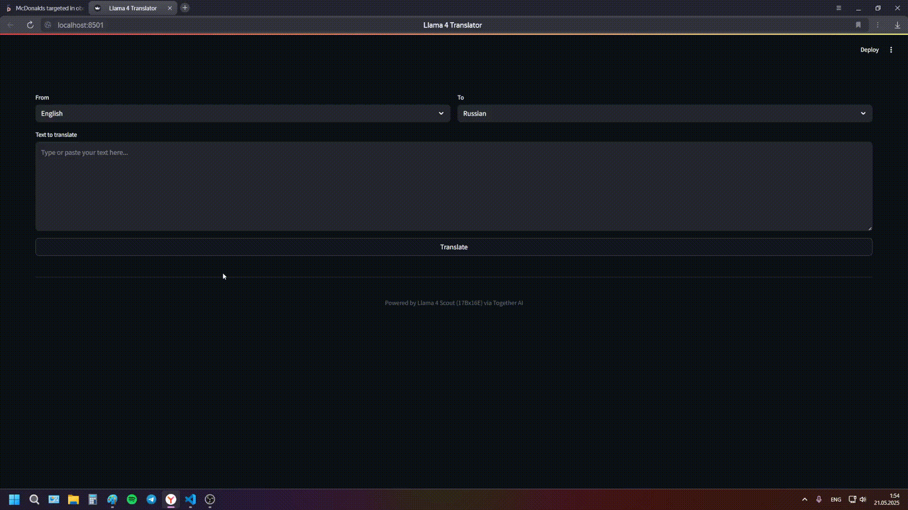

# LLM Переводчик

 

Мощный переводчик на основе модели Llama 4 Scout Instruct (17Bx16E) с удобным веб-интерфейсом

- Поддержка 7+ языков 
- Использование продвинутой модели Llama 4 Scout
- Быстрый перевод с сохранением контекста
- Локальный запуск на одном компьютере


##  Технологии

- **Backend**: FastAPI + Together AI API
- **Frontend**: Streamlit
- **Модель**: Llama 4 Scout Instruct (17Bx16E)


### Установка и запуск

1. Клонируйте репозиторий
2. Получите API ключ от [Together AI](https://together.ai)
3.  Создайте .env файл и укажите в нём ваш ключ
```bash
TOGETHER_API_KEY=ВАШ_КЛЮЧ
```
4. Запуск
```bash
python run.py
```
